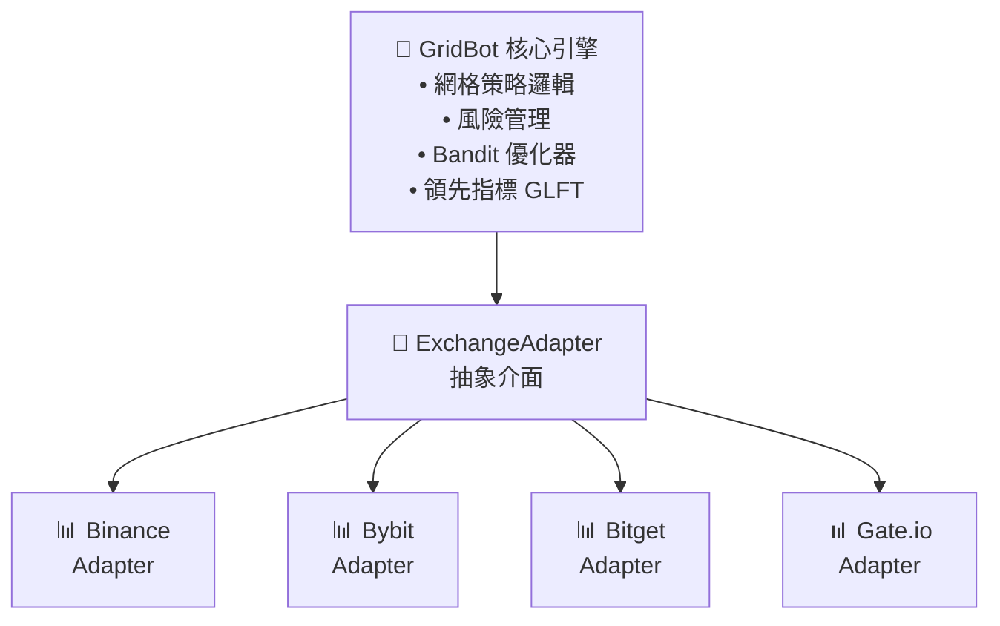

# AS Grid Dragon 刷怪籠

**加密貨幣多交易所自動化網格交易系統**

[](https://www.threads.com/@mr.__.l)

---

## 系統簡介

AS Grid Dragon（刷怪籠）是一套專業的加密貨幣網格交易機器人，採用 **Exchange Adapter Pattern** 架構，統一支援多家主流交易所。系統透過 WebSocket 即時監控市場價格，自動執行網格買賣策略。

### 💻 使用模式

| 模式 | 適用對象 | 優勢 | 界面 |
|------|----------|------|------|
| **終端版** | 個人交易者 | 輕量級、快速、低資源 | Rich CLI |
| **Web 版** | 團隊、雲端 | 圖形化、多用戶 | Streamlit |

### 支援交易所

| 交易所 | 合約類型 | 狀態 |
|--------|----------|------|
| Binance | USDT 永續 | ✅ 已支援 |
| Bybit | USDT 永續 | ✅ 已支援 |
| Bitget | USDT 永續 | ✅ 已支援 |
| Gate.io | USDT 永續 | ✅ 已支援 |

---

## 系統架構



### 目錄結構

```
AS刷怪籠/
├── core/                    # 核心模組
│   ├── bot.py              # 網格機器人引擎
│   └── strategy.py         # 策略邏輯
│
├── exchanges/              # 交易所適配器
│   ├── base.py            # 抽象介面定義
│   ├── binance.py         # Binance 實作
│   ├── bybit.py           # Bybit 實作
│   ├── bitget.py          # Bitget 實作
│   └── gate.py            # Gate.io 實作
│
├── indicators/             # 指標系統
│   ├── bandit.py          # Multi-Armed Bandit 優化器
│   └── leading.py         # GLFT 領先指標
│
├── backtest/              # 回測模組
│   ├── backtester.py      # 回測引擎
│   └── data_loader.py     # 歷史數據載入
│
├── web/                   # Web 介面 (Streamlit)
│   └── pages/
│       ├── 1_📈_交易監控.py
│       ├── 2_⚙️_交易對管理.py
│       ├── 3_🔬_回測優化.py
│       └── 4_🛠️_設定.py
│
├── config/                # 配置檔
├── Dockerfile
└── docker-compose.yml
```

---

## 快速開始

### 方式 1：終端版（推薦新手）

✅ **優點**：輕量級、快速、不需要 Docker

#### 1. 安裝 Python 3.10+

前往 [Python 官網](https://www.python.org/downloads/) 下載安裝

#### 2. 克隆專案

```bash
git clone https://github.com/thankcoom/as-grid-dragon.git
cd as-grid-dragon
```

#### 3. 安裝依賴

```bash
pip install -r requirements-terminal.txt
```

#### 4. 運行程式

```bash
python as_terminal_max.py
```

#### 5. 交互式菜單

> **🎮 AS 網格交易系統 MAX**  
> Funding Rate · GLFT · 動態網格

**主菜單選項：**

| 選項 | 功能 | 說明 |
|------|------|------|
| `1` | 🚀 開始交易 | 啟動實時交易監控 |
| `2` | ⚙️ 管理交易對 | 新增/編輯交易對設定 |
| `3` | 🔬 回測/優化 | 歷史數據回測與參數優化 |
| `4` | 🎯 MAX 增強設定 | 裝死模式、加倍止盈等 |
| `5` | 🧠 學習模組 | Bandit/DGT 自動優化 |
| `6` | 🛡️ 風控設定 | 保證金、倉位限制 |
| `7` | 🔑 API 設定 | 交易所憑證配置 |
| `0` | 👋 離開 | 退出程式 |

功能說明：
- **管理交易對**：新增/編輯交易對、設定網格參數
- **回測優化**：歷史數據回測、參數搜尋最佳化
- **API 設定**：輸入交易所憑證 (API Key/Secret)
- **風控設定**：保證金追蹤止盈、值位上限

#### 6. 實時交易面板

當啟動交易後，系統會顯示 Rich 終端實時監控面板：

<table>
<tr>
<td width="50%">

**📊 帳戶狀態**
| 幣種 | 權益 | 可用 | 保證金 | 浮盈 |
|------|------|------|--------|------|
| USDC | 1234.56 | 1000.00 | 23.4% | +12.34 |
| USDT | 2345.67 | 2000.00 | 15.2% | +45.67 |

</td>
<td width="50%">

**🧠 學習模組**
| 項目 | 數值 |
|------|------|
| 學習次數 | #42 |
| 當前間距 | 0.6%/0.4% |
| γ係數 | 0.10 |
| OFI/Vol/Spd | +0.23 2.1x 1.3x |

</td>
</tr>
</table>

**📈 交易對狀態**
| 交易對 | 價格 | 多倉 | 空倉 | 浮盈 | 狀態 | TP/GS |
|--------|------|------|------|------|------|-------|
| XRP | 2.3456 | 10.0 | 5.0 | +2.34 | ✅ 正常 | 0.40/0.60 |
| BTC | 43210.5 | 0.01 | 0.0 | +5.67 | ⚡ 多×2 | 0.35/0.55 |

特性：
- 📊 **即時監控**：每秒更新價格、持倉、浮盈
- 🧠 **自動學習**：Bandit 模型自動優化參數
- ⚡ **裝死模式**：持倉過大時自動停止補倉
- 🎯 **精確控制**：加倍止盈、動態間距調整

---

### 方式 2：Docker 部署（Web 介面）

✅ **優點**：圖形化界面、多人協作、雲端部署

---

## Docker 部署

### 1. 安裝 Docker

下載並安裝 [Docker Desktop](https://www.docker.com/products/docker-desktop/)

### 2. 克隆專案

```bash
git clone https://github.com/thankcoom/as-grid-dragon.git
cd as-grid-dragon
```

### 3. 啟動服務

```bash
docker-compose up -d
```

### 4. 開啟介面

瀏覽器打開: **http://localhost:8501**

### 5. 查看日誌

```bash
docker logs -f as-grid-trading
```

### 6. 停止服務

```bash
docker-compose down
```

---

## Web 介面說明

### 📈 交易監控
- 即時價格與持倉狀態
- 網格訂單視覺化
- 盈虧統計圖表

### ⚙️ 交易對管理
- 新增/移除交易對
- 設定網格參數（數量、間距、投資額）
- 啟動/停止單一幣種

### 🔬 回測優化
- 歷史數據回測
- 參數優化搜尋
- 績效報告生成

### 🛠️ 設定
- 選擇交易所
- 輸入 API Key / Secret
- 槓桿與風控參數

---

## 配置說明

### 各交易所認證機制

| 交易所 | API Key | API Secret | Passphrase | 說明 |
|--------|---------|------------|------------|------|
| Binance | ✅ | ✅ | ❌ | 2 因素認證 |
| Bybit | ✅ | ✅ | ❌ | 2 因素認證 |
| Gate.io | ✅ | ✅ | ❌ | 2 因素認證 |
| **Bitget** | ✅ | ✅ | **✅ 必需** | **3 因素認證** |

> **為什麼 Bitget 需要 Passphrase？**
>
> 這是 Bitget 官方 API 的強制安全設計。創建 API Key 時必須設定一個 Passphrase（密碼短語），每次 API 請求都需要這三個憑證。即使 API Key 和 Secret 洩露，沒有 Passphrase 仍無法操作，提供額外一層安全保護。

### API 權限需求

| 權限 | 必要性 |
|------|--------|
| 讀取帳戶 | ✅ 必須 |
| 合約交易 | ✅ 必須 |
| 提現 | ❌ 不需要 |

### 網格參數

| 參數 | 說明 | 建議值 |
|------|------|--------|
| 網格數量 | 買賣單總數 | 10-20 |
| 網格間距 | 每格價差 % | 0.3-1.0% |
| 投資額 | 單幣種資金 | 依資金量 |
| 槓桿 | 合約槓桿倍數 | 5-20x |

---

## 核心功能

### 網格策略
在設定價格區間內，以固定間距自動掛單買低賣高

### Bandit 優化器
使用 Multi-Armed Bandit 演算法動態調整:
- 網格間距
- 倉位大小
- 止盈止損閾值

### GLFT 領先指標
Grid Leading Flow Trigger - 根據市場流動性調整網格密度

### 風險管理
- 單幣種倉位上限
- 總資金風險控制
- 自動止盈止損

---

## 風險提示

⚠️ **重要聲明**

- 加密貨幣交易具有高風險
- 過去績效不代表未來表現
- 請僅使用可承受損失的資金
- 建議先使用測試網 (Testnet) 驗證

---

## 作者

**Louis**

[](https://www.threads.com/@mr.__.l)

---

## 交易所註冊

| 交易所 | 推薦連結 |
|--------|----------|
| Binance | [註冊](https://accounts.binance.com/register?ref=ASLOUIS) |
| Bybit | [註冊](https://www.bybit.com/invite?ref=B1MDMYE) |
| Bitget | [註冊](https://partner.bitget.fit/bg/aslouis) |
| Gate.io | [註冊](https://www.gatenode.xyz/signup/VLUSXFLFAQ?ref_type=103) |

---

## License

MIT License
